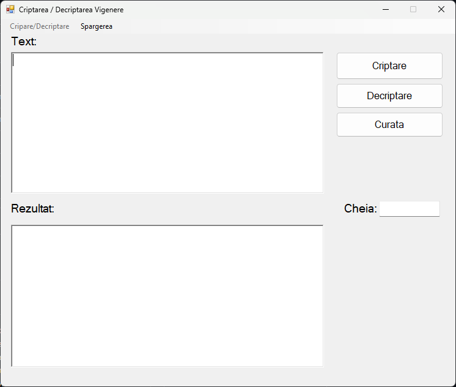
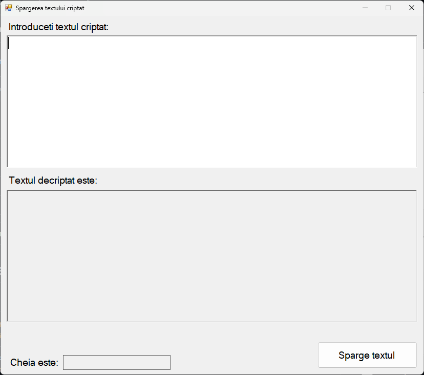

Vigenère Cipher Tool
====================

Overview
--------

The Vigenère Cipher Tool is a Windows Forms application developed to perform encryption, decryption, and cracking of the Vigenère cipher, a polyalphabetic substitution cipher. This tool was created using C# and provides a user-friendly interface for handling text encryption and decryption with a customizable key, as well as an automated key-cracking feature based on frequency analysis. The application includes two forms: one for manual encryption/decryption and another for breaking the cipher without knowing the key.
Features

--------

* **Encryption**: Encrypt text using the Vigenère cipher with a user-provided key, preserving case and non-letter characters.
* **Decryption**: Decrypt Vigenère-encrypted text using the same key, maintaining original formatting.
* **Key Cracking**: Automatically estimate the key length and crack the key using statistical analysis of letter frequencies, tailored to approximate Romanian language patterns.
* **User Interface**: Simple interface with text input/output fields and buttons for encryption, decryption, clearing, and cracking.

Technologies Used
-----------------

* **C#**: Primary programming language for implementing the cipher logic and UI.
* **Windows Forms**: Framework for building the graphical user interface.
* **Visual Studio**: Development environment for coding and debugging.

Installation
------------

1. **Prerequisites**:
   * Install Visual Studio with .NET Framework support.
2. **Setup**:
   * Clone the repository or download the project files.
   * Open the solution file (`.sln`) in Visual Studio.
   * Build the solution to compile the application.
3. **Running the Application**:
   * Launch the application from Visual Studio or the generated executable.
   * Use the main form to encrypt/decrypt text or open the cracking form via the menu.

Usage
-----

1. **Main Form (Encryption/Decryption)**:
   
   * **Input Text**: Enter the text to encrypt or decrypt in the first rich text box.
   * **Key**: Provide a key in the text box (e.g., "KEY").
   * **Encrypt**: Click the "Encrypt" button to encrypt the text.
   * **Decrypt**: Click the "Decrypt" button to decrypt the text.
   * **Clear**: Click the "Clear" button to reset all fields.
   * **Crack**: Select "Spargerea" from the menu to open the cracking form.

2. **Cracking Form**:
   
   * **Input Ciphertext**: Enter the encrypted text in the rich text box.
   * **Crack**: Click the button to estimate the key length and crack the key.
   * **Output**: View the estimated key length, cracked key, and decrypted plaintext in the respective fields.

Algorithm Details
-----------------

* **Encryption/Decryption**: Uses the Vigenère cipher algorithm, shifting each letter by the corresponding letter in the key (modulo 26), preserving case and non-letter characters.
* **Key Length Estimation**: Analyzes repeated sequences and calculates the Index of Coincidence (IC) to estimate the key length, with a threshold of 0.06 indicating a likely match.
* **Key Cracking**: Applies frequency analysis by comparing shifted letter frequencies in ciphertext segments to approximate Romanian language frequencies, determining the most likely key character.

Security
--------

* The tool uses basic frequency analysis for cracking, which may not be effective against very short texts or highly randomized keys.
* No persistent data storage; all operations are performed in memory.

Future Improvements
-------------------

* **Enhanced Frequency Analysis**: Support for multiple languages by allowing customizable frequency tables.
* **Key Length Refinement**: Improve accuracy with advanced statistical methods or machine learning.
* **GUI Enhancements**: Add input validation and error handling for better user experience.

License
-------

This project is licensed under the MIT License. See the [LICENSE](https://grok.com/LICENSE) file for details.
Acknowledgments

---------------

Developed by Mihai Lungu as a personal project to explore cryptographic techniques.

* * *

